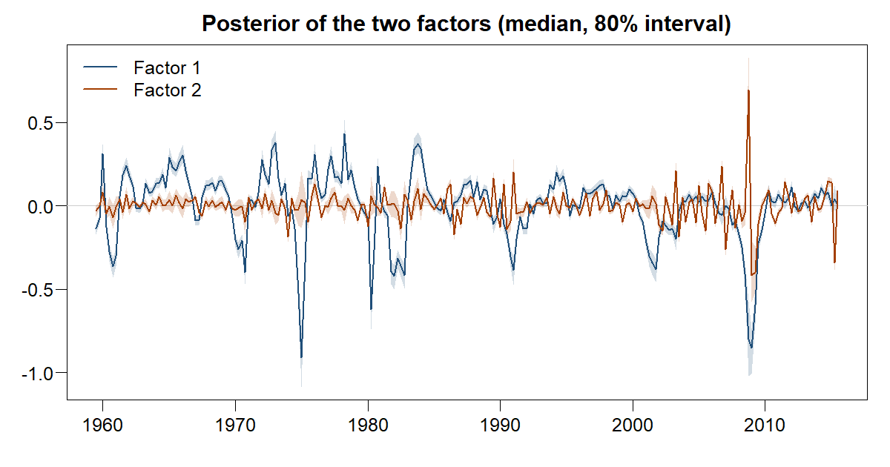

<!-- README.md is generated from README.Rmd. Please edit that file -->

# dfmtools

[](https://github.com/franzmohr/dfmtools/actions/workflows/R-CMD-check.yaml)
[](https://www.gnu.org/licenses/old-licenses/gpl-2.0.en.html)
[](https://lifecycle.r-lib.org/articles/stages.html#experimental)

[](https://github.com/sponsors/franzmohr)
[](https://www.buymeacoffee.com/franzmohr)

Bayesian inference of dynamic factor models. `dfmtools` builds the model
object, attaches priors and starting values, and hands the whole thing
to a Gibbs sampler written in C++, following the treatments in Chan,
Koop, Poirier and Tobias (2019) and Lütkepohl (2006).

The model is a measurement equation

$$x_t = \lambda f_t + u_t, \qquad u_t \sim N(0, U),$$

for an $M \times 1$ vector of observed variables $x_t$ and $N \times 1$
unobserved factors $f_t$, together with a transition equation

$$f_t = \sum_{i=1}^{p} A_i f_{t-i} + v_t, \qquad v_t \sim N(0, V).$$

Five blocks are drawn in turn: the path of the factors, the loadings,
the two error precisions and the transition coefficients. `U` and `V`
are diagonal and estimated with independent gamma priors on their
precisions.

Both error terms may instead carry stochastic volatility, with
`create_dfmodel(error = "sv")`. `U` and `V` then become `U_t` and `V_t`,
the log-volatility of every error term following a random walk of its
own, and the sampler gains two blocks. The two placements do different
work: volatility in `u_t` reweights the series that identify the
factors, so a series that was noisy early and quiet later stops
contributing on the same terms throughout, while volatility in `v_t` is
the common component’s own and is what keeps the `M` idiosyncratic
variances from jointly absorbing a shock that every series felt at once.
The loadings and the transition stay constant either way.

## Installation

`dfmtools` needs `bvartools (>= 1.0.0)`, which is not on CRAN yet, so
both come from GitHub:

``` r
# install.packages("remotes")
remotes::install_github("franzmohr/bvartools")
remotes::install_github("franzmohr/dfmtools")
```

A C++17 compiler and GNU make are required to build from source — Rtools
on Windows, the Xcode command line tools on macOS.

## Usage

A model is specified, given priors and starting values, and then drawn
from. Each step returns the same object with one more element on it.

``` r
library(dfmtools)

set.seed(123456789)

data("bem_dfmdata")

dim(bem_dfmdata)
#> [1] 225 196
```

`bem_dfmdata` is 225 quarters of 196 US macroeconomic series, taken from
the data sets accompanying Chan et al. (2019). Two factors and a
transition of order two:

``` r
model <- create_dfmodel(x = bem_dfmdata, p = 2, n = 2,
                        iterations = 5000, burnin = 1000)

model <- add_priors(model,
                    lambda = list(vinv = 0.01),
                    u = list(shape = 5, rate = 4),
                    a = list(vinv = 0.01),
                    v = list(shape = 5, rate = 4))

model <- add_initial_values(model)
```

`create_dfmodel` normalises every column of `x` by default, so the
loadings are comparable across series. Priors on `lambda` and `a` are
specified as *precisions*; `u` and `v` take the shape and rate of the
gamma prior on the error precisions. For `error = "sv"` those two
arguments take a stochastic volatility specification instead — `mu`,
`v_i`, `shape`, `rate`, `state_variance` and `offset`, the same six
`bvartools` uses for its VAR and VEC models — and `add_initial_values`
returns a log-volatility path per error term rather than a precision
matrix.

``` r
set.seed(6023)

model <- add_posterior_coefficients(model)

vapply(model$posterior, function(x) paste(dim(x$coeffs), collapse = " x "), "")
#>       lambda      factors            a  u_sigma_inv  v_sigma_inv 
#> "5000 x 392" "5000 x 450"   "5000 x 8" "5000 x 196"   "5000 x 2"
```

Draws run along the rows, so a posterior mean is a column mean. Each
block is a `coda::mcmc` matrix, and the whole of a `T`-period factor
path is part of every draw: the factors are unobserved, so neither the
forecast nor the log-likelihood can be recomputed without it.

Only the product $\lambda f_t$ is identified, so the leading
$N \times N$ block of the loading matrix is fixed unit lower triangular
rather than drawn. It is reported all the same, so that a draw is
reshaped rather than unpacked:

``` r
lambda <- matrix(colMeans(model$posterior$lambda$coeffs),
                 nrow = model$model$m, ncol = model$model$n,
                 dimnames = list(colnames(model$data$x), c("f1", "f2")))

round(head(lambda, 6), 3)
#>            f1     f2
#> GDPC96  1.000  0.000
#> PCECC96 3.790  1.000
#> PCDGx   3.602 -0.290
#> PCESVx  2.120  1.469
#> PCNDx   2.725  0.407
#> GPDIC96 4.340  1.205
```

The factor path is stored period by period, all `N` factors of a period
together, which makes a single factor a strided slice:

``` r
tt <- nrow(model$data$x)
n <- model$model$n

factor_draws <- function(i) model$posterior$factors$coeffs[, seq(i, tt * n, by = n)]

f1 <- apply(factor_draws(1), 2, quantile, probs = c(0.1, 0.5, 0.9))
dim(f1)
#> [1]   3 225
```



### Forecasts

A dynamic factor model needs no out-of-sample regressors, so only the
horizon has to be supplied. Each draw’s path is the transition run
forward from the last `p` drawn factors with an innovation at every
step, and the observable variables are read off the loadings — both
error terms drawn, so the result is from the posterior predictive
distribution rather than a conditional mean.

``` r
model <- add_posterior_forecasts(model, n_ahead = 8)

dim(model$posterior$forecast)
#> [1] 5000 1568
```

The horizons are stacked within a row in the variable order of the
sample, so reshaping a draw to $M \times h$ puts the variables in the
rows:

``` r
gdp <- which(colnames(model$data$x) == "GDPC96")

fc <- t(apply(model$posterior$forecast[, seq(gdp, 8 * model$model$m,
                                            by = model$model$m)],
              2, quantile, probs = c(0.1, 0.5, 0.9)))
rownames(fc) <- paste0("h = ", 1:8)

round(fc, 3)
#>          10%    50%   90%
#> h = 1 -1.097  0.051 1.223
#> h = 2 -1.151  0.033 1.220
#> h = 3 -1.144  0.010 1.238
#> h = 4 -1.143  0.029 1.224
#> h = 5 -1.209 -0.008 1.192
#> h = 6 -1.183  0.026 1.162
#> h = 7 -1.219 -0.018 1.204
#> h = 8 -1.221 -0.020 1.226
```

Those are in the units of the normalised data. Multiplying by the sample
standard deviation of the series and adding its mean back returns them
to the original scale.

### Log-likelihood

`add_posterior_loglik` returns the pointwise log-likelihood laid out for
WAIC and PSIS-LOO: draws along the rows, observations along the columns.
It is the measurement density at the drawn factors, so it is the
log-likelihood *conditional* on the factor path rather than the marginal
one — which matters for what an information criterion computed from it
means.

``` r
model <- add_posterior_loglik(model)

dim(model$posterior$loglik)
#> [1] 5000  225

# WAIC, computed on a log scale so that 196 variables do not underflow.
ll <- model$posterior$loglik
logmeanexp <- function(z) {
  mx <- max(z)
  mx + log(mean(exp(z - mx)))
}

lppd <- sum(apply(ll, 2, logmeanexp))
p_waic <- sum(apply(ll, 2, stats::var))

round(-2 * (lppd - p_waic), 1)
#> [1] 106690
```

### Several specifications at once

Integer vectors for `p` or `n` produce one model per combination, and
the rest of the chain maps over them:

``` r
models <- create_dfmodel(x = bem_dfmdata, p = 1:2, n = 1:2,
                         iterations = 200, burnin = 100)

length(models)
#> [1] 4

vapply(models, function(z) sprintf("p = %d, n = %d", z$model$p, z$model$n), "")
#> [1] "p = 1, n = 1" "p = 2, n = 1" "p = 1, n = 2" "p = 2, n = 2"
```

### Factor augmented VARs

`create_favarmodel()` fits a factor augmented VAR, where a block of
observed variables joins the factors in the state and the transition
runs over both. The chain is the same one — `add_priors()`,
`add_initial_values()`, `add_posterior_coefficients()` — and `irf()`
computes impulse responses from the result.

Identification is the part worth reading about rather than guessing
at. `Q` is unrestricted by construction, which is what the model is
estimated for, so it has no preferred rotation and a recursive
ordering is an assumption the estimated model cannot test. The
vignette [Identifying a monetary policy
shock](vignettes/favar-monetary-policy.Rmd) works one through on the
design of Bernanke, Boivin and Eliasz (2005), from ordering the panel
to reading the responses:

    vignette("favar-monetary-policy", package = "dfmtools")

## Where the sampler lives

Posterior simulation is not implemented in R. `src/core/` and
`inst/include/bayests/` are vendored copies of part of the core layer of
[BayesTS](https://github.com/franzmohr/BayesTS), and this package is a
translation layer over it — the same arrangement `bvartools` uses for
its VAR and VEC models. `src/core/VENDORED.md` records which files are
copied, how that set is computed from the `#include` graph, and the one
modification applied on the way in.

The practical consequence for a user is that `set.seed()` reaches the
sampler: Armadillo’s RNG is R’s own.

## Getting help

- Bugs and feature requests:
  [issues](https://github.com/franzmohr/dfmtools/issues)
- Contributing: [.github/CONTRIBUTING.md](.github/CONTRIBUTING.md)
- Numerical issues in the sampler itself belong in
  [BayesTS](https://github.com/franzmohr/BayesTS/issues)

## References

Bernanke, B. S., Boivin, J., & Eliasz, P. (2005). Measuring the
effects of monetary policy: A factor-augmented vector autoregressive
(FAVAR) approach. *The Quarterly Journal of Economics*, 120(1),
387-422.

Chan, J., Koop, G., Poirier, D. J., & Tobias, J. L. (2019). *Bayesian
Econometric Methods* (2nd ed.). Cambridge: Cambridge University Press.

Lütkepohl, H. (2006). *New Introduction to Multiple Time Series
Analysis* (2nd ed.). Berlin: Springer.

McCracken, M. W., & Ng, S. (2016). FRED-MD: A monthly database for
macroeconomic research. *Journal of Business & Economic Statistics*,
34(4), 574-589.

## License

GPL (\>= 2). The vendored BayesTS files carry BSD-3-Clause headers,
which is compatible; `inst/COPYRIGHTS` lists them file by file and also
notes that `bem_dfmdata` is third-party data whose terms are not this
package’s to grant.
