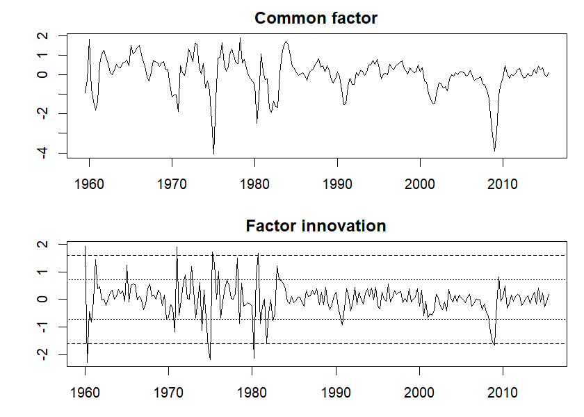
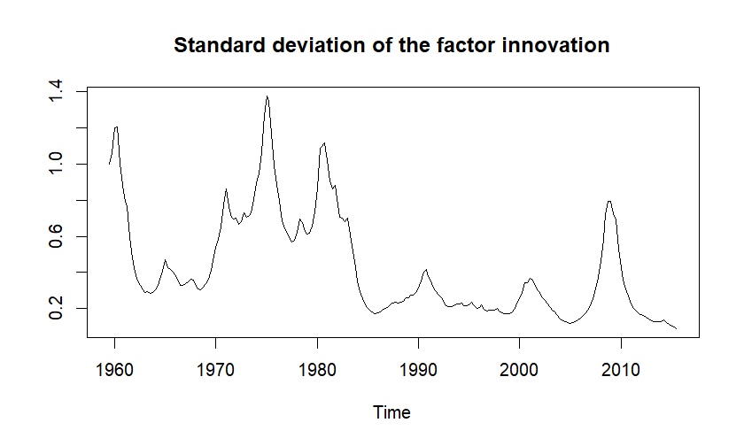
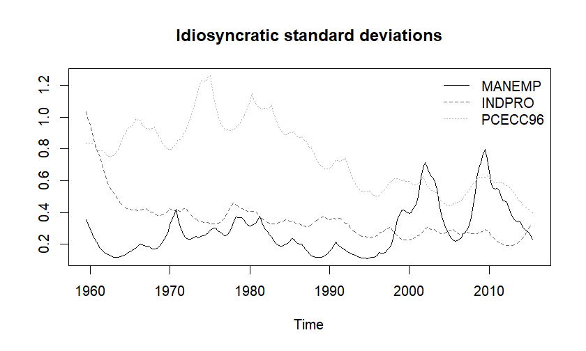
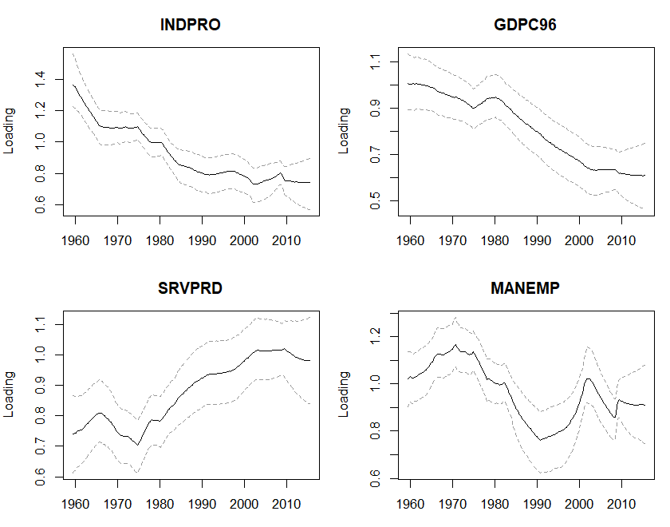
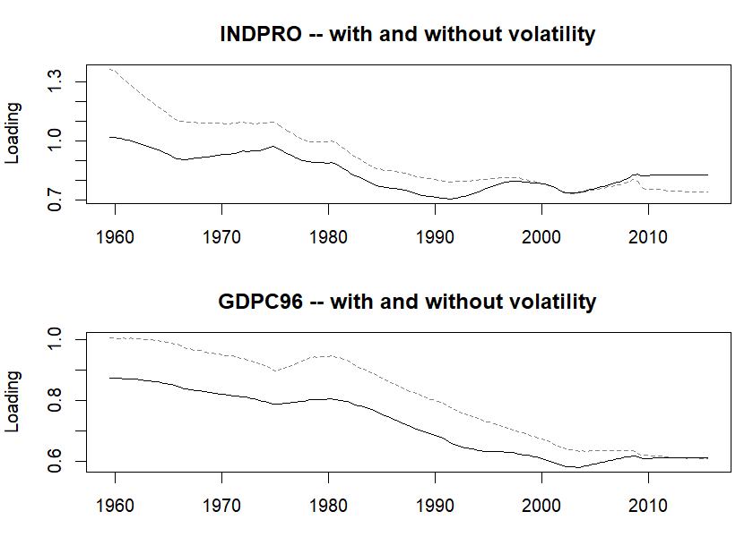
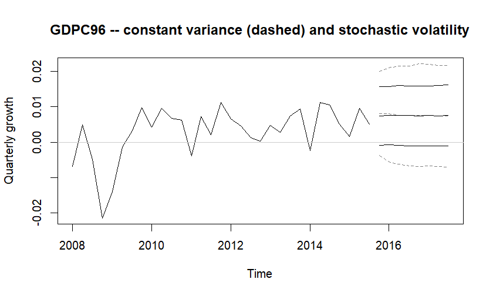

A dynamic factor model estimated on half a century of quarterly data makes two
assumptions that are easy to miss because they are never written down. The first
is that every series' exposure to the common component was the same in 1959 as in
2015. The second is that the shocks -- the common one and each series' own --
were the same size throughout. Neither holds for US macroeconomic data over that
period, and both failures are well documented: the volatility of aggregate
activity fell sharply in the mid-1980s and returned in 2008, and the composition
of output shifted away from manufacturing over the whole sample.

`create_dfmodel()` has one argument for each. `error = "sv"` replaces the two
constant error variances with log-volatilities that follow random walks, and
`tvp = TRUE` lets both coefficient blocks -- the loadings and the transition --
follow random walks of their own. They combine, so there are four algorithms
rather than two, and what each of them does to the same panel is the subject of
this vignette.


``` r
library(dfmtools)
data("bem_dfmdata")
```

## The panel

Ten quarterly measures of US real activity, in the FRED-QD transformations that
`bem_dfmdata` ships with, so everything is a growth rate except the unemployment
rate, which is differenced.


``` r
series <- c("PAYEMS", "GDPC96", "INDPRO", "IPFINAL", "CMRMTSPLx",
            "MANEMP", "SRVPRD", "PCECC96", "GPDIC96", "UNRATE")

x <- bem_dfmdata[, series]
c(quarters = nrow(x), series = ncol(x))
#> quarters   series 
#>      225       10
```

Which series comes first is a decision. The identifying restriction fixes the
leading `n x n` block of the loading matrix at unit lower triangular, so with one
factor the first series has a loading of exactly one and the factor is that
series' common component, in its units. Payroll employment goes first because it
is broad and smooth: whatever share of it is common is a stable thing to measure
the rest against, and a noisy series in that position makes the factor noisy for
everyone.

## The constant model, and what it cannot do

Start with both arguments at their defaults -- constant loadings, constant
variances -- for something to compare against.


``` r
set.seed(1984)
baseline <- create_dfmodel(x = x, p = 2, n = 1, iterations = 10000, burnin = 2000)
baseline <- add_priors(baseline)
baseline <- add_initial_values(baseline)
baseline$initial$lambda[] <- 1
baseline <- add_posterior_coefficients(baseline)

round(colMeans(baseline$posterior$lambda$coeffs), 2)
#>  [1]  1.00  0.84  0.97  0.95  0.87  1.01  0.86  0.62  0.79 -0.94
```

Every series loads positively on the factor except the unemployment rate, which
is what a factor of real activity should look like. It is worth checking that
much before reading anything else, because the sampler has a second mode in which
it is not true -- the last section says what the line setting `initial$lambda` is
doing there and why every model below repeats it.

The transition is an AR(2) in the factor, and the residual of that AR is the
common shock the model estimates a single variance for.


``` r
tt <- nrow(x)
f <- ts(colMeans(baseline$posterior$factors$coeffs),
        start = start(x), frequency = 4)
a <- colMeans(baseline$posterior$a$coeffs)

v <- ts(f[3:tt] - a[1] * f[2:(tt - 1)] - a[2] * f[1:(tt - 2)],
        start = time(f)[3], frequency = 4)

opar <- par(mfrow = c(2, 1), mar = c(3, 4, 2, 1))
plot(f, main = "Common factor", ylab = "")
plot(v, main = "Factor innovation", ylab = "")
abline(h = c(-2, 2) * sd(window(v, end = c(1983, 4))), lty = 2)
abline(h = c(-2, 2) * sd(window(v, start = c(1984, 1))), lty = 3)
```



``` r
par(opar)

c(before_1984 = sd(window(v, end = c(1983, 4))),
  after_1984 = sd(window(v, start = c(1984, 1))))
#> before_1984  after_1984 
#>   0.8012877   0.3610577
```

The innovation is less than half as large after 1984 as before it. The model has
one number for that variance, so what it reports is an average of two regimes,
too large for the 1990s and too small for the 1970s -- and every forecast
interval it produces inherits the compromise.

## Stochastic volatility

`error = "sv"` gives each error term a log-volatility that follows a random walk,
estimated with the mixture approximation of Omori et al. (2007). Both error terms
get one: `u` is the idiosyncratic error of each of the ten series, `v` the
innovation to the factor.

The prior takes six elements rather than two and has no default, so `u` and `v`
both have to be given the whole specification. The names are the ones `bvartools`
uses for the stochastic volatility priors of its VAR models.


``` r
sv <- list(mu = 0, v_i = 1, shape = 3, rate = 0.2,
           state_variance = 0.05, offset = 1e-4)

set.seed(1984)
model_sv <- create_dfmodel(x = x, p = 2, n = 1, error = "sv",
                           iterations = 10000, burnin = 2000)
model_sv <- add_priors(model_sv, u = sv, v = sv)
model_sv <- add_initial_values(model_sv)
model_sv$initial$lambda[] <- 1
model_sv <- add_posterior_coefficients(model_sv)
```

`mu = 0` and `v_i = 1` say the log-volatility starts near zero, which is a
variance near one -- the right neighbourhood, since `normalize_x = TRUE` has
scaled every column to unit variance. `shape` and `rate` are the prior on the
variance of the log-volatility innovations and control how fast the volatility
may move; `offset` keeps the logarithm of a squared residual finite when a
residual lands on zero.

What comes back is a precision per period rather than one precision, so a
volatility path is a summary of the chain reshaped to periods.


``` r
# u_sigma_inv holds M precisions per period and v_sigma_inv holds N of them,
# periods along a row. Standard deviations read more easily than precisions.
volatility <- function(model, block) {
  chain <- model$posterior[[paste0(block, "_sigma_inv")]]$coeffs
  width <- if (block == "u") model$model$m else model$model$n
  ts(matrix(sqrt(1 / colMeans(chain)), ncol = width, byrow = TRUE),
     start = start(model$data$x), frequency = 4)
}
```


``` r
v_sd <- volatility(model_sv, "v")

plot(v_sd, main = "Standard deviation of the factor innovation", ylab = "")
```



The Great Moderation is the middle of that picture. The innovation runs at half
a standard deviation of payroll employment growth or more through the 1970s,
peaks near 1.4 in the 1974-75 recession, falls away after 1984 and spends the
1990s at a quarter of where the sample started. It rises again through 2008 and
2009, and then falls to its sample low.


``` r
decade <- (floor(time(v_sd)) %/% 10) * 10
round(tapply(as.numeric(v_sd), decade, mean), 2)
#> 1950 1960 1970 1980 1990 2000 2010 
#> 1.03 0.46 0.78 0.46 0.24 0.31 0.18
round(window(v_sd, start = c(2007, 1), end = c(2009, 4)), 2)
#>      Qtr1 Qtr2 Qtr3 Qtr4
#> 2007 0.21 0.25 0.31 0.37
#> 2008 0.46 0.58 0.72 0.80
#> 2009 0.79 0.73 0.69 0.53
```

The idiosyncratic volatilities are the other half of what `error = "sv"` adds,
and they do not all move the same way.


``` r
u_sd <- volatility(model_sv, "u")
colnames(u_sd) <- series

plot(u_sd[, c("MANEMP", "INDPRO", "PCECC96")], plot.type = "single",
     col = c("black", "grey40", "grey70"), lty = 1:3, ylab = "",
     main = "Idiosyncratic standard deviations")
legend("topright", c("MANEMP", "INDPRO", "PCECC96"),
       col = c("black", "grey40", "grey70"), lty = 1:3, bty = "n")
```



``` r

round(cbind(sixties = colMeans(window(u_sd, end = c(1969, 4))),
            aughts = colMeans(window(u_sd, start = c(2000, 1)))), 2)
#>           sixties aughts
#> PAYEMS       0.27   0.30
#> GDPC96       0.69   0.51
#> INDPRO       0.53   0.26
#> IPFINAL      0.55   0.34
#> CMRMTSPLx    0.60   0.37
#> MANEMP       0.19   0.45
#> SRVPRD       0.53   0.53
#> PCECC96      0.86   0.53
#> GPDIC96      0.85   0.45
#> UNRATE       0.57   0.52
```

Industrial production and consumption became quieter relative to the factor;
manufacturing employment became noisier. A constant-variance model has to average
over that, and the series that moved furthest is the one it fits worst.

## Time varying coefficients

`tvp = TRUE` puts a random walk on both coefficient blocks. Every freely
estimated loading and every transition coefficient becomes a path, drawn whole
with the simulation smoother of Durbin and Koopman (2002). The fixed block does
not move: it is the normalisation that identifies the factor, and a drifting
normalisation would let the factor's rotation and scale wander over the sample.

Both `lambda` and `a` then need a `shape` and a `rate` on top of the `vinv` they
already took, and there is no default for the pair. `vinv` now describes the
state of the period before the sample rather than a coefficient that holds
throughout.


``` r
drift <- list(vinv = 0.01, shape = 3, rate = 0.001)

set.seed(1984)
model_tvp <- create_dfmodel(x = x, p = 2, n = 1, tvp = TRUE,
                            iterations = 10000, burnin = 2000)
model_tvp <- add_priors(model_tvp, lambda = drift, a = drift)
model_tvp <- add_initial_values(model_tvp)
model_tvp$initial$lambda[] <- 1
model_tvp$initial$lambda_init[] <- 1
model_tvp <- add_posterior_coefficients(model_tvp)
```

That `rate` is the knob worth understanding before anything is read off the
result. With `shape = 3`, an inverse gamma prior with `rate = 0.001` puts the
variance of one quarter's drift at 0.0005 on average, which compounds over 224
quarters into a random walk with a standard deviation of about
0.33. At `rate = 0.01`, the value the help pages
use, the same arithmetic gives about 1.06 -- a
loading free to wander further over the sample than its own level, which this
panel cannot identify and which mostly buys the model somewhere to put variation
it has no other way to describe.

The loadings come back the way the volatilities did, as one matrix per period.


``` r
# lambda holds the whole M x N matrix of a period, periods along a row, so with
# one factor a period's entries are the M series in order.
loading_path <- function(model, name, probs = c(0.16, 0.5, 0.84)) {
  m <- model$model$m
  i <- match(name, colnames(model$data$x))
  cols <- (seq_len(nrow(model$data$x)) - 1) * m + i
  ts(t(apply(model$posterior$lambda$coeffs[, cols], 2, quantile, probs = probs)),
     start = start(model$data$x), frequency = 4)
}

opar <- par(mfrow = c(2, 2), mar = c(3, 4, 3, 1))
for (name in c("INDPRO", "GDPC96", "SRVPRD", "MANEMP")) {
  plot(loading_path(model_tvp, name), plot.type = "single",
       col = c("grey60", "black", "grey60"), lty = c(2, 1, 2),
       main = name, ylab = "Loading")
}
```



``` r
par(opar)
```

The bands are the 68% posterior interval of the loading in that period, and they
are wide enough to matter: what the model says is that industrial production's
exposure fell over the sample, not that it fell by a particular amount. Services
employment moved the other way. Manufacturing employment ends the sample close to
where it began and is nowhere near constant in between: its exposure rises into
the early 1970s, falls through to the mid-1990s and comes back, which is a shape
no summary of the two endpoints would report.

How much drift the data supports is a chain of its own, one number per free
loading, in `sigma`.


``` r
round(sqrt(colMeans(model_tvp$posterior$lambda$sigma)), 3)
#> [1] 0.024 0.034 0.024 0.025 0.039 0.025 0.021 0.022 0.036
```

A quarter's drift is a couple of hundredths of a loading, which is small period
by period and is not small over 224 of them.

## Both at once

The two specifications are independent, and carrying both is not redundant. A
series whose loading fell looks a great deal like a series whose idiosyncratic
variance rose, and a period of common turbulence looks like a transition that
changed, so a model with only one of the two has to explain the other with what
it has. That is not hypothetical here: the constant-variance model above ran
through a sample whose common shock shrank by half, and drifting loadings were
the only place it could put that.


``` r
set.seed(1984)
model_both <- create_dfmodel(x = x, p = 2, n = 1, error = "sv", tvp = TRUE,
                             iterations = 30000, burnin = 10000)
model_both <- add_priors(model_both, lambda = drift, a = drift, u = sv, v = sv)
model_both <- add_initial_values(model_both)
model_both$initial$lambda[] <- 1
model_both$initial$lambda_init[] <- 1
model_both <- add_posterior_coefficients(model_both)
```


``` r
opar <- par(mfrow = c(2, 1), mar = c(3, 4, 3, 1))
for (name in c("INDPRO", "GDPC96")) {
  plot(cbind(loading_path(model_tvp, name)[, 2],
             loading_path(model_both, name)[, 2]),
       plot.type = "single", col = c("grey50", "black"), lty = c(2, 1),
       ylab = "Loading", main = paste(name, "-- with and without volatility"))
}
```



``` r
par(opar)

total_drift <- function(model) {
  sapply(series, function(name) {
    path <- loading_path(model, name)[, 2]
    path[length(path)] - path[1]
  })
}

round(cbind(tvp = total_drift(model_tvp), tvp_sv = total_drift(model_both)), 2)
#>             tvp tvp_sv
#> PAYEMS     0.00   0.00
#> GDPC96    -0.39  -0.26
#> INDPRO    -0.62  -0.19
#> IPFINAL   -0.24  -0.10
#> CMRMTSPLx -0.23  -0.05
#> MANEMP    -0.11   0.06
#> SRVPRD     0.24   0.25
#> PCECC96   -0.07  -0.01
#> GPDIC96   -0.25  -0.06
#> UNRATE    -0.11  -0.16
```

The loadings still fall, and they fall by less. Part of what the
constant-variance model was reading as a decline in exposure was the common shock
getting smaller, which is a statement about the factor rather than about any
series' relation to it, and once the model has somewhere else to put it the
loadings keep less of it.

The four models can be compared on the pointwise log-likelihood, with one large
caveat.


``` r
loglik <- function(model) {
  model <- add_posterior_loglik(model)
  mean(rowSums(model$posterior$loglik)) / nrow(model$data$x)
}

round(c(constant = loglik(baseline),
        sv = loglik(model_sv),
        tvp = loglik(model_tvp),
        both = loglik(model_both)), 2)
#> constant       sv      tvp     both 
#>    -7.93    -6.30    -7.64    -5.82
```

The caveat is that this is the measurement density evaluated at the drawn factor
path, so it is conditional on the states rather than marginal over them, and a
model with more states to condition on is flattered by it. It is the quantity a
sampler that draws the states can report without a filtering pass per draw, and
conditional WAIC computed from it assesses a model that treats the states as
parameters. Read as a ranking of fit it says that the volatility is the bigger of
the two omissions in this panel -- adding it buys more than drifting loadings do
-- which is consistent with everything above and is not by itself model choice.

## Forecasting, and what it costs

Neither specification is extrapolated over the forecast horizon. The loadings,
the transition and both volatilities are held at their last in-sample period,
which is what the posterior supports: the variance of the state innovations is
part of the chain rather than something the draws carry forward, so there is
nothing to run the random walks on with.

Held rather than extrapolated is still very different from constant, because the
value being held is the one that ended the sample.


``` r
horizon <- 8

forecast <- function(model) {
  model <- add_posterior_forecasts(model, n_ahead = horizon)
  i <- match("GDPC96", series)
  draws <- model$posterior$forecast[, (seq_len(horizon) - 1) * model$model$m + i]
  band <- t(apply(draws, 2, quantile, probs = c(0.05, 0.5, 0.95)))
  ts(band * attr(model$data$x, "scaled:scale")[i] +
       attr(model$data$x, "scaled:center")[i],
     start = c(2015, 4), frequency = 4)
}

f_constant <- forecast(baseline)
f_sv <- forecast(model_sv)

history <- window(x[, "GDPC96"], start = c(2008, 1))

plot(cbind(history, f_constant, f_sv), plot.type = "single",
     col = c("black", rep(c("grey50", "black"), each = 3)),
     lty = c(1, rep(c(2, 1), each = 3)), ylab = "Quarterly growth",
     main = "GDPC96 -- constant variance (dashed) and stochastic volatility")
abline(h = 0, col = "grey80")
```



``` r

round(cbind(constant = f_constant[, 3] - f_constant[, 1],
            sv = f_sv[, 3] - f_sv[, 1]), 3)
#>         constant    sv
#> 2015 Q4    0.024 0.016
#> 2016 Q1    0.026 0.016
#> 2016 Q2    0.028 0.017
#> 2016 Q3    0.028 0.017
#> 2016 Q4    0.029 0.017
#> 2017 Q1    0.029 0.017
#> 2017 Q2    0.028 0.017
#> 2017 Q3    0.029 0.017
```

The forecast is of the normalised series, which is why the scale and the centre
that `create_dfmodel()` left on `data$x` are put back before anything is read as
a growth rate. The 90% interval from the stochastic volatility model is between a
third and two fifths narrower at every horizon, because the volatility it holds forward is the
2015 volatility rather than an average of everything since 1959 -- and had the
sample ended in 2009 the comparison would run the other way.

The cost of all this is time and mixing. On the sample above the constant model
takes a second or two, either extension on its own takes something over ten
seconds, and the two together take over a minute for three times the draws --
which is why this vignette is precompiled. The draws are also worth less
individually.


``` r
# The fixed elements of lambda are constant across draws, so only the freely
# estimated ones have an effective sample size worth reporting.
ess <- function(model) {
  size <- coda::effectiveSize(model$posterior$lambda$coeffs)
  round(quantile(size[size > 0], probs = c(0.05, 0.5)))
}

rbind(constant = ess(baseline), sv = ess(model_sv),
      tvp = ess(model_tvp), both = ess(model_both))
#>            5%  50%
#> constant 1538 2173
#> sv        289  475
#> tvp       215 1548
#> both      411 2079
```

Stochastic volatility costs the most per draw here: the 10000 iterations that
leave the constant model's loadings with a couple of thousand effective draws
leave the volatility model's with a few hundred, which is why the model with both
runs 30000.

## The other mode

Every model above was handed a starting value for the loadings rather than the
one `add_initial_values()` produces, and this is why. That function draws from the
prior, and the default prior on a loading is a precision of 0.01 -- a standard
deviation of ten, so the starting values are scattered over a range no loading in
a normalised panel would occupy, with signs as likely to be wrong as right.

From a badly signed start the sampler can settle on a mirror image of the model:
the factor is the negative of the common component, every free loading turns
negative to match it, and the one series whose loading is fixed at plus one is
treated as noise, its idiosyncratic variance absorbing nearly all of its
variation. It is a local mode rather than an equivalent parameterisation -- the
log-likelihood is far worse there, and burn-in does not escape it, since turning
the factor around would have to pass through configurations no single Gibbs step
will take. Which mode a run lands in depends on the seed, and it happens to the
constant model as readily as to the extensions.

Two lines guard against it. Starting every loading at one puts the sampler on the
right side to begin with:


``` r
model <- add_initial_values(model)
model$initial$lambda[] <- 1        # and lambda_init[], if tvp = TRUE
```

and the sign of the loadings is worth a look afterwards, as at the top of this
vignette. A factor negatively correlated with a panel of activity series is the
symptom.

## References

Chan, J., Koop, G., Poirier, D. J., & Tobias, J. L. (2019). *Bayesian Econometric
Methods* (2nd ed.). Cambridge: Cambridge University Press.

Del Negro, M., & Otrok, C. (2008). Dynamic factor models with time-varying
parameters: measuring changes in international business cycles. *Federal Reserve
Bank of New York Staff Report* No. 326.

Durbin, J., & Koopman, S. J. (2002). A simple and efficient simulation smoother
for state space time series analysis. *Biometrika, 89*(3), 603--615.

McCracken, M. W., & Ng, S. (2016). FRED-MD: A monthly database for macroeconomic
research. *Journal of Business & Economic Statistics, 34*(4), 574--589.

Omori, Y., Chib, S., Shephard, N., & Nakajima, J. (2007). Stochastic volatility
with leverage. Fast and efficient likelihood inference. *Journal of Econometrics,
140*(2), 425--449.
